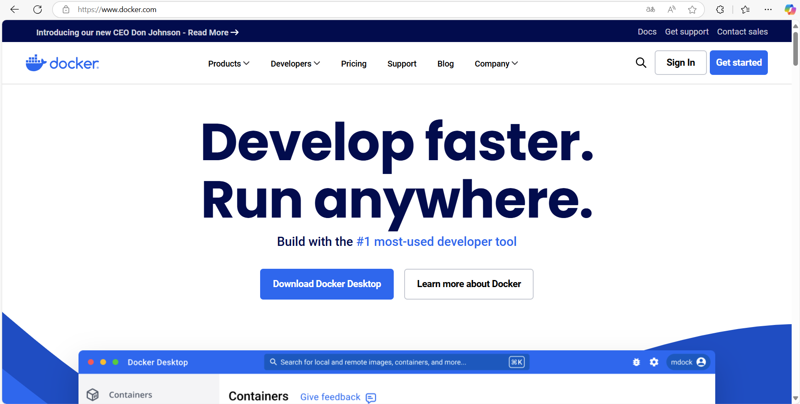
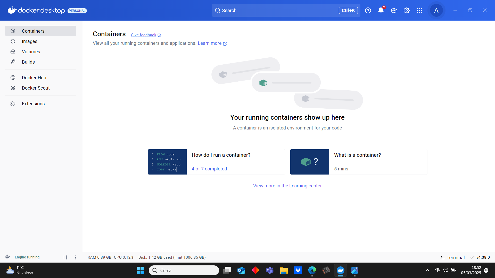
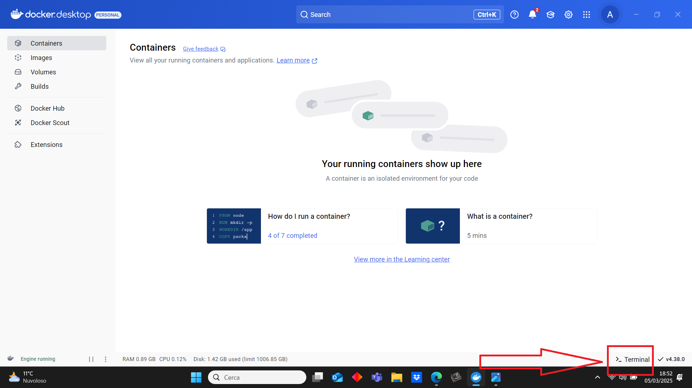
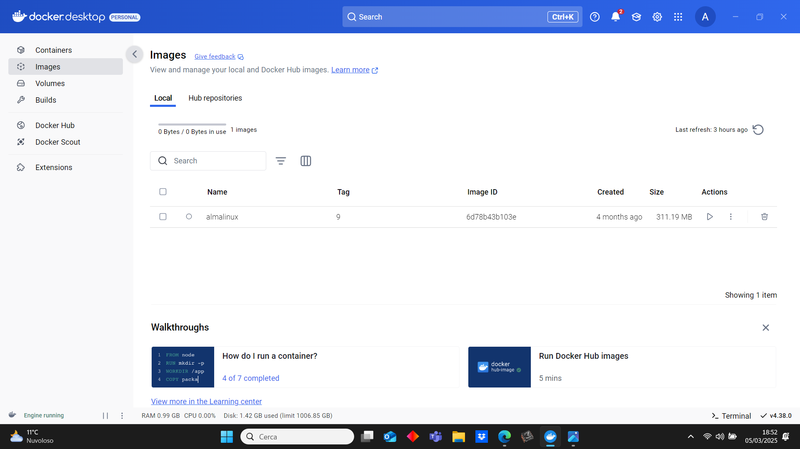
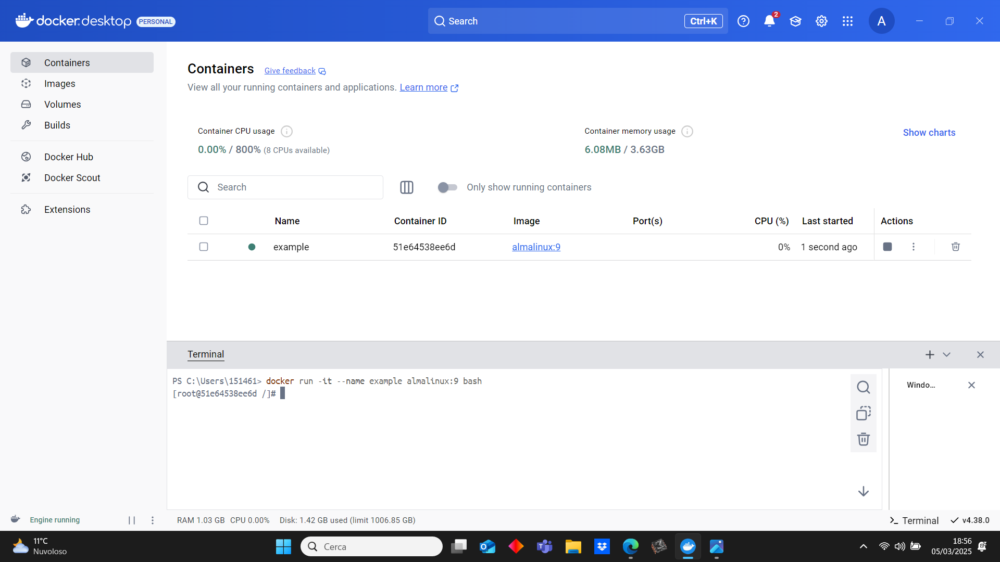

# **How to install Docker and Almalinux9 on Windows** 
---

## **Introduction**
The goal of this guide is to explain how to install Docker on Windows and how to install and run an Almalinux 9 container thanks to it.

[Docker](https://en.wikipedia.org/wiki/Docker_(software)) is an OS-virtualization based open-source software that allows to install and run applications in isolated environments called **containers**, which are faster and lighter with respect to a traditional Virtual Machine. We will use it to install and run an [Almalinux9](https://en.wikipedia.org/wiki/AlmaLinux) container.
## **Preliminaries: installing Windows Subsystem for Linux (WSL)**
In order to work, Docker requires a _Linux-compatible environment_. Thus, before installing Docker, we need to install **Windows Subsystem for Linux (WSL)** from the terminal:
1. Open the terminal.
2. Install WSL with the command
```
wsl --install
```
3. Set the default version of WSL to 2
```
wsl --set-default-version 2
```

## **Installing Docker**
We are now ready to install Docker. The first step is to go to the [official Docker website](https://www.docker.com/) and clik on the **Download Docker Desktop** button:



Then select to download the version for **Windows-AMD64**. The download of the Docker Installer will automatically start. Once the Installer is ready, start it and procede with the installation of Docker Desktop. At the end of it, the program will restart Windows, then ask for a registration. It is possible to create a new Docker account or to use a Github one.

After this procedure, open Docker Desktop and it should be ready to use:



It is possible to get more information on Docker in general [here](https://docs.docker.com/get-started/resources/). In the next section we will focus on the creation of an Almalinux 9 container

## **Running an Almalinux 9 container**
The first step to create an Almalinux 9 container is to download an Almalinux 9 image. In order to do so, open the Docker terminal identified by the icon >_



Then use the following command:
```
docker pull almalinux:9
```
This will install the image, which will be listed in the **Images** section:



To create the container, now type in the terminal
```
docker run -it --name example almalinux:9 bash
```
In this way you will create an Almalinux 9 container with the name "example" and open its bash. The container will appear in the **container** section and will be ready to be used:



To **exit** the container, type the command 
```
exit
```
To **stop** it, write in the terminal 
```
docker stop example
```
where *example* is a placeholder to substitute with the name of the container to stop.

To **start** it again after closing it, use the command
```
docker start example
```
To **open** the `bash` of a runnig container, type
```
docker exec -it example bash
```
